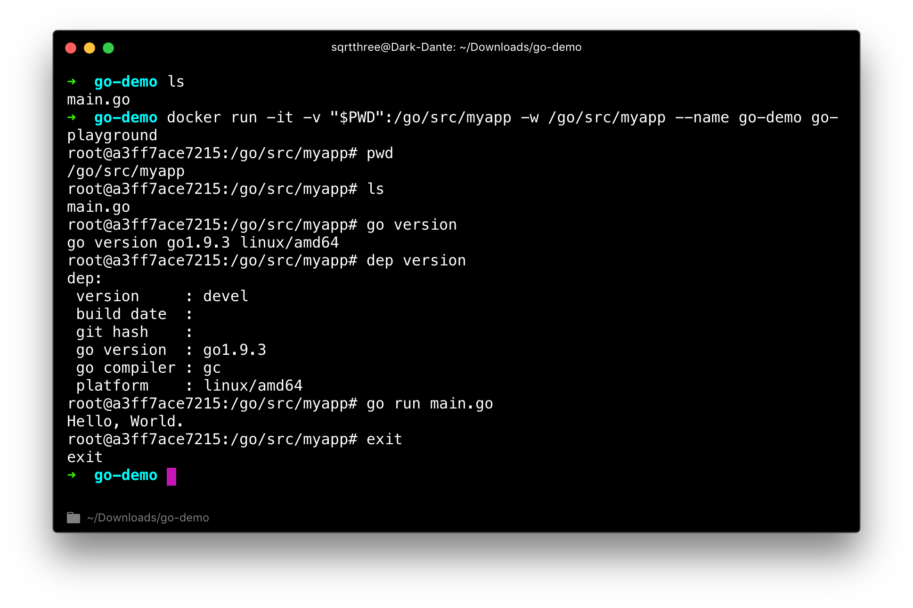

# go-playground

Go playground based on [Docker](https://docs.docker.com/install/).

It provides a stand-alone go environment with [dep](https://github.com/golang/dep) support.



## Install

```bash
git clone https://github.com/sqrthree/go-playground.git

cd go-playground

docker build -t go-playground .
```

## Usage

Into your `go` project directory which you will write some codes, for example, `myapp`, and run the following command:

```
docker run -it --rm -v "$PWD":/go/src/myapp -w /go/src/myapp --name go-demo go-playground
```

By default, you will be attached to this container. Then you can run any command with `go` and `dep`.
